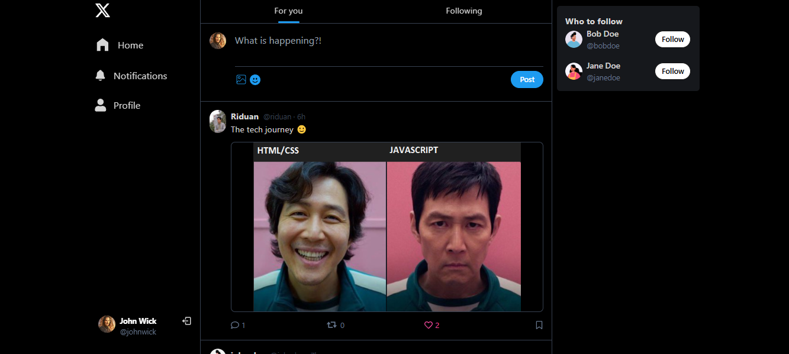

# Twitter Clone 

A modern, full-featured Twitter clone built with the MERN stack. Includes JWT authentication, post creation, likes, comments, profile editing, image uploads via Cloudinary, and real-time notifications — all in a clean, mobile-responsive UI.

---


## 🔗 Preview

 
--
🌍 Live Demo - https://x-clone-smr.onrender.com/

---

## 🚀 Features

- 🔐 **Secure Authentication** using JSON Web Tokens (JWT)
- 🔥 **Optimized Data Fetching & Caching** with React Query
- 👥 **Suggested Users to Follow** for better user engagement
- ✍️ **Create New Posts** with optional image uploads
- 🗑️ **Delete Posts** (with permission checks for owners)
- 💬 **Comment on Posts** in real-time
- ❤️ **Like and Unlike Posts**
- 📝 **Edit Profile Details**, including name, bio, and location
- 🖼️ **Update Profile & Cover Images**
- 📷 **Cloudinary Integration** for image uploads and storage
- 🔔 **Real-time Notifications** for key user actions
- 📱 **Fully Responsive Design** for mobile and desktop

---

## 🖥️ Tech Stack

### 🚀 Frontend

- [React.js](https://react.dev/) – UI library for building interactive interfaces
- [React DOM](https://react.dev/) – DOM bindings for React
- [React Router DOM](https://reactrouter.com/) – Routing and navigation
- [React Query (TanStack)](https://tanstack.com/query/latest) – Data fetching and caching
- [React Hot Toast](https://react-hot-toast.com/) – Toast notifications
- [React Icons](https://react-icons.github.io/react-icons/) – Popular icon packs as React components
- [Emoji Picker React](https://github.com/ealush/emoji-picker-react) – Emoji selection component
- [Tailwind CSS](https://tailwindcss.com/) – Utility-first CSS framework
- [DaisyUI](https://daisyui.com/) – UI components built on top of Tailwind CSS

### 🛠 Backend

- [Node.js](https://nodejs.org/) & [Express.js](https://expressjs.com/)
- [Mongoose](https://mongoosejs.com/) – MongoDB object modeling
- [JWT](https://jwt.io/) – Authentication using JSON Web Tokens
- [BcryptJS](https://github.com/dcodeIO/bcrypt.js) – Password hashing
- [Cloudinary](https://cloudinary.com/) – Image uploads and storage
- [Cookie-Parser](https://github.com/expressjs/cookie-parser) – Parse cookies in requests
- [CORS](https://github.com/expressjs/cors) – Enable cross-origin requests
- [Dotenv](https://github.com/motdotla/dotenv) – Load environment variables from `.env` file

---


## <a name="getting-started">🚀 Getting Started</a>

To get started follow these steps:

#### Cloning the Repository

Using CLI

```bash
git clone https://github.com/smRid/Twitter-Clone.git
```

**\*\*_Ensure you have installed [Git](https://git-scm.com) on your machine._**

or using GitHub:

-   Go to the project [repository](https://github.com/smRid/Twitter-Clone) on my GitHub page
-   Click on the green button on the top 👆
-   Click Download ZIP


### ⚙️ Installation


## Setup .env file
```bash
MONGODB_URI=...
PORT=5001
JWT_SECRET=...

CLOUDINARY_CLOUD_NAME=...
CLOUDINARY_API_KEY=...
CLOUDINARY_API_SECRET=...

NODE_ENV=development
```

Install the project dependencies using npm:

### Build the app

```bash
npm run build
```

**\*\*_Ensure you have installed [NodeJS](https://nodejs.org/en) on your machine._**

### Start the app

```bash
npm run start
```

**\*\*_Navigate to http://localhost:5000 in your browser to access the local development server._**
